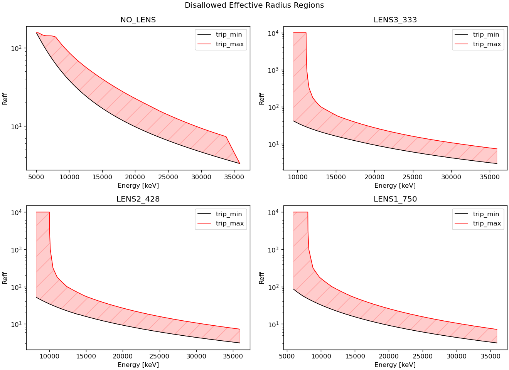

ioc-mfx-tfs-lens
================

MFX transfocator lens IOC.

Interlock system
================

Part of the Beryllium lens interlock system, paired with
[pcdshub/lcls-plc-mfx-be-lens-interlock](https://github.com/pcdshub/lcls-plc-mfx-be-lens-interlock)

Python code
===========

Automated calculation of beryllium lens focusing optics for MFX Transfocator with ophyd in Python:
[pcdshub/transfocate](https://github.com/pcdshub/transfocate)
